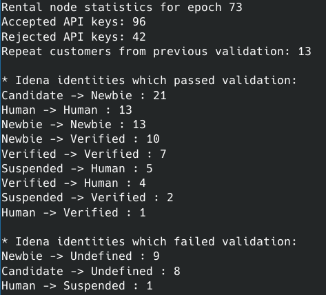

# idena-node-proxy validation log parser
A command-line log parser for idena-node-proxy logs, creating validation statistics for administartors of idena shared/rented nodes.



## Introduction

[idena-node-proxy](https://github.com/idena-network/idena-node-proxy) is used to provide multiple different identities shared access to an [idena](https://idena.io) Proof-of-Person blockchain [node](https://github.com/idena-network/idena-go).

This command-line script parses the log file created on the idena-node-proxy during an idena validation ceremony.

## Caveats

* This script was created to work with a shared node set up using my [Idena shared node guide](https://github.com/pocoloko/idena-shared-node-guide) and may not work with your setup, but probably will provided you have the correct log files.
* idena-node-proxy log files should be written to a file (access.log by default) using the ```"logs": { "output": "file",``` option in the config.json file as described in [step 3 of my shared node guide](https://github.com/pocoloko/idena-shared-node-guide#step-3-install-idena-node-proxy). If you are writing logs to the default ```stdout``` its up to you to extract them to an appropriate file to be able to use the instructions for this log parser.
* The log parser uses the dna_identity entries from the log file on the day of validation, meaning it will include anyone that connected to your node whether they actually validated on your node or not. The actual validation results are retrieved from the idena API using the identity that connected to your node, meaning that if the identity only connected to your node once but in the end switched to a different node for validation, they will still be included in the statistics. You should also make sure that the API keys from previous validations are removed from your idena-node-proxy before validation day.
* It is recommended that you keep all the individual log files created by the full instructions below, and keep them for each validation, as features could be added to this script to make use of them retroactively.
* It is required to keep the (for example)```73_ids_good.txt``` file that the script generates for each epoch processed, this is used to calculate the "Repeat customers from previous validation" statistic. If this file is not present for the previous statistic, it will show as zero repeat customers.
* The "Rejected API keys" statistic are identities trying to use an old API key for your node from a previous validation, or some random API key, or an API key for a different node, it is surprising how often this happens.


## Instructions

The script is not fully automated and requires some manual actions performed before the data is actually analyzed. **Ideally, this is done immediately after concensus on validation has been reached** to not pick up identities connecting to your node for the next validation.

1. Complete the [Script Usage](https://github.com/pocoloko/idena-node-proxy-logparser#script-usage) section first
2. Change directory to wherever your access.log file from idena-node-proxy is located: ```cd idena-node-proxy```
3. Extract only the log entries for the date of the validation (edit the date and filename to match the validation you want to parse from logs) : ```cat access.log | grep 2021-09-21 > validation.epoch.74.log```
4. This validation.epoch.74.log file now contains all the logs for that specific validation day, but we only want the dna_identity entries: ```cat validation.epoch.74.log | grep dna_identity > dna_identity.epoch.74.log```
5. Now, because dna_identity endpoint is accessed many times by every identity, we need to remove all duplicates: ```awk '!a[$3]++' dna_identity.epoch.74.log > dna_identity.epoch.74.unique.log```
6. We now have the file we will actually process with the log parser script, so: ```./logparser.py dna_identity.epoch.74.unique.log 74```

## Script Usage

1. clone this repo
2. make sure you have the [requests python library](https://docs.python-requests.org/en/master/) installed
3. rename `logparser.ini_default` to `logparser.ini`. You do not need to edit anything in this version of the script.
4. Follow the [instructions](https://github.com/pocoloko/idena-node-proxy-logparser#instructions) above

